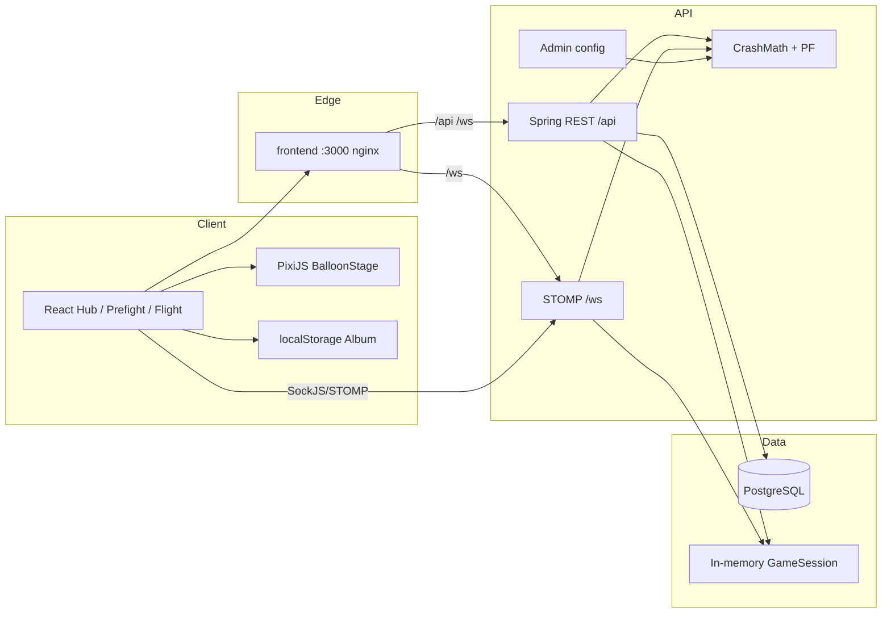
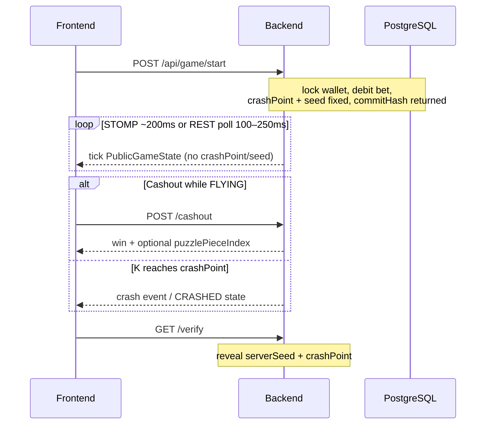

# AeroQuest — Victorian Steampunk Crash Game

**Воздушный Шар** · Hot-air balloon crash · Provably fair · Real-time · Steampunk UI

[](https://openjdk.org/)
[](https://spring.io/projects/spring-boot)
[](https://react.dev/)
[](https://pixijs.com/)
[](https://www.docker.com/)
[](pom.xml)
[](#7-getting-started)

> High-performance bonus **crash** game with Victorian Steampunk aesthetics, real-time STOMP WebSocket updates, server-authoritative math, and provably fair mechanics — plus a client-side puzzle album.

**Docs for jury / tuning:** [docs/expert-guide.md](docs/expert-guide.md) · Frontend notes: [frontend/README.md](frontend/README.md) · Specs: `.specs/`

---

## Table of contents

1. [Demo & visuals](#2-demo--visuals)
2. [About the project](#4-about-the-project)
3. [Key features](#5-key-features)
4. [Architecture](#6-architecture--tech-deep-dive)
5. [Getting started](#7-getting-started)
6. [Configuration & admin](#8-configuration--admin-guide)
7. [API documentation](#9-api-documentation)
8. [Roadmap](#10-roadmap)
9. [Contributing & license](#11-contributing--license)
10. [Acknowledgments](#12-acknowledgments)

---

## 2. Demo & visuals

### One-minute run

```bash
docker compose up --build
```

Then open **[http://localhost:3000](http://localhost:3000)** — play Hub → theme baskets → Prefight → Flight → Result → Album.

| Surface | URL |
|---------|-----|
| **Game UI** | [http://localhost:3000](http://localhost:3000) |
| **API health** | [http://localhost:8080/actuator/health](http://localhost:8080/actuator/health) |
| **Admin / OpenAPI** | [http://localhost:8080/swagger-ui.html](http://localhost:8080/swagger-ui.html) |

> **Admin is not a separate `/admin` page.** Runtime balance is tuned via Swagger → Authorize → `AdminKey` = `change-me-in-prod` → `GET`/`PUT /api/admin/config`. See [§8](#8-configuration--admin-guide).

### Visual walkthrough (for the jury)

Drop a short screen recording / GIF here before the pitch (recommended ~20–40 s):

1. Hub — swaying LUCKY / STANDARD aerostat baskets  
2. Flight — map-toned sky, altimeter K, steam booster flash  
3. Crash or cashout → Result parchment + puzzle fragment  
4. Album — 24-slot map collection  

```text
docs/demo.gif          ← add recording
docs/presentation.pdf  ← optional jury slides
```

<!-- Example once the file exists:

-->

**Live demo:** use the Docker stack above (or paste your tunnel / Cloudflare URL here when deployed).

---

## 4. About the project

### The problem

Bonus / crash games often feel like **generic casino UI**: flat multipliers, no identity, no reason to return after the first cashout. Visuals and collection loops are usually an afterthought.

### The solution

**AeroQuest** wraps classic crash math in a **Victorian Steampunk adventure**:

- Distinct **red (LUCKY)** vs **green (STANDARD)** aerostats — silhouette + economy differ  
- **Immersive flight** (PixiJS) with map atmosphere, altimeter readout, burner/steam VFX  
- **Puzzle album** — fragments awarded on terminal rounds, persisted in `localStorage`  
- **Hot admin config** — change α, house edge, themes, boosters **without redeploy**  
- **Provably fair** — crash & seed committed at start; reveal only after the round ends  

### Built with

| Layer | Stack |
|-------|--------|
| **Backend** | Java **21**, Spring Boot **3.4**, Spring WebSocket (STOMP), JPA, Flyway, PostgreSQL **16** |
| **Frontend** | React **19**, TypeScript, Vite, **PixiJS 8**, Framer Motion, Zustand, `@stomp/stompjs` |
| **DevOps** | Docker + Docker Compose (postgres · backend · frontend/nginx) |
| **Contract** | springdoc OpenAPI / Swagger UI |

Player identity: header `X-Player-Id`. Admin: header `X-Admin-Key`. No Spring Security login form (hackathon-friendly).

---

## 5. Key features

| | Feature | Why it matters |
|---|---------|----------------|
| Immersive gameplay | Server-clock \(K(t)=e^{αt}\), Pixi flight, STOMP ticks + REST poll fallback | Smooth real-time feel without trusting the client for crash |
| Steampunk UI | Parchment / brass chrome, theme baskets, meter font for K, themed SFX | Instant visual identity for the jury |
| Collection | 24-slot puzzle album (`balloon.puzzleAlbum.{playerId}`) | Retention loop **without** new backend APIs |
| Dual themes | STANDARD calmer α / lower bet · LUCKY faster α / higher ceiling | Real economy difference, not cosmetic only |
| Boosters | Finite charges; AUTO consumes 1; multiplies K + points on line trigger | Extra tension mid-flight |
| Admin control | `PUT /api/admin/config` partial JSON merge | Jury can retune balance live |
| Provably Fair | `crash-v1` commit at start; `GET /verify` after terminal | Transparent honesty story |
| Resilience | FLYING → VOID + refund on process restart; rate limits on start/cashout | Production-shaped edge cases |

---

## 6. Architecture & tech deep dive



### Round lifecycle



### Key decisions

| Choice | Rationale |
|--------|-----------|
| **PixiJS** for flight | Canvas performance, ticker pause on hidden tab, low-detail gate on small viewports |
| **STOMP WebSocket** | Low-latency ticks; REST `/state` remains the fallback |
| **Server-authoritative K** | Same clock formula for all clients; crash decided at start |
| **Config snapshot per round** | Mid-flight `PUT` admin changes do **not** move flying rounds (I8) |
| **Album on client** | Ships collection UX without Spec-2 ledger work |

---

## 7. Getting started

### Prerequisites

- **Docker Desktop** (ports **3000**, **8080**, **5433** free)
- Optional for local FE HMR: **Node 20+**
- Optional for local BE: **Java 21** + Maven wrapper (`./mvnw`)

### Install & run (recommended)

```bash
git clone <this-repo>
cd balloon-game
docker compose up --build
```

| Service | URL |
|---------|-----|
| Game | http://localhost:3000 |
| API | http://localhost:8080 |
| Swagger (admin + player API) | http://localhost:8080/swagger-ui.html |

Stop: `Ctrl+C`, then `docker compose down` if needed. Postgres data: volume `postgres-data`.

### Swagger quick path

1. Open Swagger → **Authorize**  
2. **PlayerId** = `demo` (any string)  
3. **AdminKey** = `change-me-in-prod`  
4. `POST /api/players/demo/deposit` → `{"amount": 1000}`  
5. `POST /api/game/start` → copy real `gameId` (ignore OpenAPI sample UUIDs)  
6. Poll state / cashout / verify  

### Frontend HMR only

```bash
docker compose up postgres backend
cd frontend && npm install && npm run dev
```

UI: http://localhost:5173 (Vite proxies `/api`, `/ws`).

### Backend HMR-ish

```bash
docker compose up postgres
SPRING_DATASOURCE_URL=jdbc:postgresql://localhost:5433/balloon_game \
SPRING_DATASOURCE_USERNAME=balloon \
SPRING_DATASOURCE_PASSWORD=balloon \
./mvnw spring-boot:run
```

Tests: `./mvnw test` (Testcontainers needs Docker).

---

## 8. Configuration & admin guide

**Endpoint:** `GET` / `PUT /api/admin/config`  
**Auth:** header `X-Admin-Key: change-me-in-prod` (Swagger Authorize → AdminKey)  
**Merge:** partial JSON; admin API key is **never** returned or changed via PUT  
**Flying rounds:** keep the config snapshot from **start** — new α applies to **new** rounds only  

### High-impact parameters

| Parameter | Default | Effect |
|-----------|---------|--------|
| `math.growthRate` (α) | `0.0433` | Speed of \(K(t)=e^{αt}\); themes override |
| `themes.standard.growthRate` | `0.0367` | Calmer green climb |
| `themes.lucky.growthRate` | `0.0567` | Faster red climb |
| `math.houseEdge` | `0.08` | PF / crash distribution |
| `math.instantCrashRate` | `0.08` | Chance of bust at min crash (1.00×) |
| `math.minCrashPoint` | `1.00` | Floor for crash |
| `math.minCashoutMultiplier` | `1.01` | Cashout blocked earlier → `CASHOUT_TOO_EARLY` |
| `pointsPerLine` | `10` | Points per height line |
| `ascentSpeedLinesPerSec` | `1.5` | Line progression pace |
| `boosters.spawnProbability` | `0.45` | Booster spawn chance |
| `admin.allowDeposit` | `true` | Demo wallet top-up (+ booster charge) |
| `admin.maxWinMultiplier` | `100` | Cap (theme may lower) |

Example hot-tune (slower climb):

```http
PUT /api/admin/config
X-Admin-Key: change-me-in-prod
Content-Type: application/json

{
  "math": { "growthRate": 0.04 },
  "themes": {
    "standard": { "growthRate": 0.033 },
    "lucky": { "growthRate": 0.05 }
  }
}
```

Full table and jury checklist: **[docs/expert-guide.md](docs/expert-guide.md)**. Defaults live in `src/main/resources/application.yml`.

---

## 9. API documentation

**Live contract:** [Swagger UI](http://localhost:8080/swagger-ui.html) · [OpenAPI JSON](http://localhost:8080/v3/api-docs)

| Method | Path | Purpose |
|--------|------|---------|
| `POST` | `/api/players/{id}/deposit` | Demo credit (+ booster charge) |
| `GET` | `/api/players/{id}/balance` | Wallet (auto-welcome balance on first get) |
| `GET` | `/api/players/leaderboard` | Points ranking |
| `POST` | `/api/game/start` | Place bet, open round → `gameId`, `commitHash` |
| `GET` | `/api/game/state/{gameId}` | Flight poll (`PublicGameState`) |
| `POST` | `/api/game/cashout/{gameId}` | Take win while `FLYING` |
| `GET` | `/api/game/verify/{gameId}` | Reveal PF after terminal |
| `GET` | `/api/game/history` | Public finished rounds (no secrets) |
| `GET`/`PUT` | `/api/admin/config` | Runtime math / themes / boosters |

**Headers:** `X-Player-Id` on game routes (must match bet owner). History is public.

**WebSocket:** `ws://localhost:8080/ws` (SockJS: `/ws-sockjs`)  
CONNECT with native-header `X-Player-Id` → subscribe `/topic/game/{gameId}`  

```json
{
  "type": "tick",
  "state": {
    "gameId": "...",
    "status": "FLYING",
    "multiplier": 1.42,
    "lineIndex": 3,
    "pointsTotal": 30,
    "booster": null
  }
}
```

`type` may be `tick` | `crash` | `cashout` | `void`. Payloads **never** include `crashPoint` / `serverSeed` while flying.

Errors: `{ "code", "message", "timestamp", "details"? }` — e.g. `INSUFFICIENT_BALANCE` (402), `FORBIDDEN` (403), `ALREADY_CRASHED` (409), `RATE_LIMITED` (429).

---

## 10. Roadmap

- [x] MVP backend — crash math, ledger, PF, admin config, STOMP  
- [x] Frontend F1–F6 — Hub → Prefight → Flight → Result  
- [x] Steampunk visual series V1–V5 — chrome, baskets, Pixi, album, SFX  
- [ ] Optional: recorded demo GIF + jury slide deck in `docs/`  
- [ ] Optional: server-persisted puzzle album (Spec 2 GAP)  
- [ ] Stretch: PWA / installable mobile shell  
- [ ] Stretch: richer sample-pack audio (CC0) instead of pure synthesis  

---

## 11. Contributing & license

Issues and PRs welcome for docs, balance presets, and visual polish. Prefer small focused commits; keep API contracts aligned with Swagger and `.specs/`.

**License:** not published in-repo yet — treat as private hackathon deliverable unless the team adds an SPDX file (MIT/Apache-2.0 recommended).

```bash
./mvnw verify          # backend
cd frontend && npm run build
```

---

## 12. Acknowledgments

- Product & engineering team behind **Воздушный Шар / AeroQuest**  
- Visual direction: Victorian Steampunk / adventure (aerostats, maps, parchment)  
- Inspiration: classic crash UX + period adventure fiction (*Around the World in Eighty Days* era aesthetics), steampunk illustration refs  
- Stack communities: Spring, React, PixiJS, Framer Motion  

---

*When in doubt: API + Spec 3 win over mockups; Spec 5 wins over old casino colors. Happy flying.*
