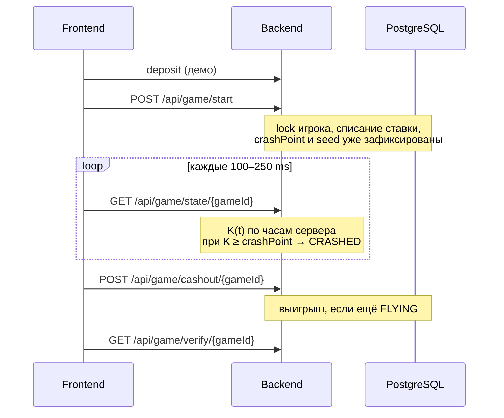

# Воздушный Шар

Backend crash-игры для хакатона. Игрок ставит деньги, шар поднимается, коэффициент \(K(t)\) растёт экспоненциально. Нужно забрать выигрыш (**cashout**) до краша. Параллельно копятся очки за линии высоты и бустер.

Исход раунда считается **на сервере до старта полёта** и не пересчитывается. Пока шар в воздухе, API не отдаёт точку краша и seed — это можно проверить только после конца раунда (Provably Fair).

Фронтенд в этот репозиторий не входит. Контракт — этот README и OpenAPI.

---

## Стек

| | |
|---|---|
| Язык | Java 21 |
| Фреймворк | Spring Boot 3.4 (Maven) |
| БД | PostgreSQL 16, миграции Flyway |
| Деньги | `BigDecimal` + таблица `wallet_ledger`, без `double` |
| Активный раунд | in-memory `GameSession` + PostgreSQL как источник правды |
| Документация API | springdoc OpenAPI 3 + Swagger UI |
| Тесты | JUnit 5, Testcontainers |
| Запуск | Docker Compose |

Авторизации как в проде нет: игрок передаётся заголовком `X-Player-Id`, админка — `X-Admin-Key`. Spring Security не подключён.

---

## Как запустить

Нужны **Docker Desktop** (на Apple Silicon это нормально) и свободные порты **8080** (API) и **5433** (Postgres на хосте).

```bash
docker compose up --build
```

Compose сначала поднимает Postgres, ждёт healthcheck, затем backend. Готовность:

- API: [http://localhost:8080/actuator/health](http://localhost:8080/actuator/health)
- Swagger UI: [http://localhost:8080/swagger-ui.html](http://localhost:8080/swagger-ui.html)
- OpenAPI JSON: [http://localhost:8080/v3/api-docs](http://localhost:8080/v3/api-docs)

### Как потыкать API в Swagger

Игр заранее нет, и UUID `3fa85f64-5717-4562-b3fc-2c963f66afa6` в форме — **заглушка OpenAPI**, не существующий раунд.

1. Справа сверху **Authorize**.
2. **PlayerId** — любая строка, например `demo`. Это не логин и не пароль, просто id игрока.
3. **AdminKey** — `change-me-in-prod` (так в Docker и в `application.yml`). `test-admin-key` есть только в автотестах, в живом сервере он невалиден.
4. Players → `POST /api/players/{id}/deposit`: в path `demo`, тело `{"amount": 1000}`. Так появляется игрок и деньги.
5. Game → `POST /api/game/start`, в теле тот же `"playerId": "demo"`, ставка например `50`, `balloonType`: `STANDARD`. В ответе будет настоящий `gameId`.
6. Этот `gameId` вставляете в **state / cashout / verify**. Execute на примере из Swagger даст 403/404 — такой игры нет.

Остановка: `Ctrl+C`, затем при необходимости `docker compose down`. Данные Postgres лежат в volume `postgres-data`.

### Backend локально, БД в Docker

Удобно, если меняете код и не хотите пересобирать образ.

```bash
docker compose up postgres
SPRING_DATASOURCE_URL=jdbc:postgresql://localhost:5433/balloon_game \
SPRING_DATASOURCE_USERNAME=balloon \
SPRING_DATASOURCE_PASSWORD=balloon \
./mvnw spring-boot:run
```

В `application.yml` по умолчанию порт Postgres **5432**. Compose пробрасывает его на хост как **5433**, поэтому локальному Spring нужен URL выше. Внутри сети Compose backend ходит на `postgres:5432` — это уже прописано в `docker-compose.yml`.

Тесты: `./mvnw test` (нужен Docker для Testcontainers).

---

## Как устроена игра



1. **Пополнение.** Для демо `POST /api/players/{id}/deposit`. В проде флаг `game.admin.allow-deposit` выключают; платёжного шлюза нет.
2. **Старт.** `POST /api/game/start` списывает ставку, пишет раунд в БД и кладёт сессию в память. В ответе `gameId` и `commitHash`. Точка краша и `serverSeed` **не** приходят.
3. **Полёт.** Клиент опрашивает `GET /api/game/state/{gameId}` каждые **100–250 ms**. Сервер считает множитель одной функцией от времени старта. Когда \(K\) догоняет заранее посчитанный `crashPoint`, статус становится `CRASHED`, ставка сгорает.
4. **Cashout.** Пока статус `FLYING` и \(K < crashPoint\), `POST /api/game/cashout/{gameId}` фиксирует выигрыш `bet × K`. Повторный cashout — ошибка. Гонка cashout/crash сериализуется локом на раунд.
5. **Проверка честности.** После `CRASHED` / `CASHED_OUT` (или `VOID` после рестарта сервера) `GET /api/game/verify/{gameId}` отдаёт seed и `crashPoint`. Пока шар летит — `409`.
6. **История.** `GET /api/game/history` — публичная лента завершённых раундов (`CRASHED` / `CASHED_OUT` / `VOID`), без `serverSeed` / `crashPoint` и без id игрока. Параметр `limit` (по умолчанию 20, максимум 100). `X-Player-Id` не нужен.

Чужой `gameId` или несовпадение `X-Player-Id` с `playerId` ставки → **403**, не 404: UUID чужих раундов не палим.

---

## API для фронта

Живой контракт — Swagger. Сначала **Authorize**, потом deposit → start → копируете `gameId`.

| Метод | Путь | Зачем |
|-------|------|--------|
| `POST` | `/api/players/{id}/deposit` | Демо-пополнение, создаёт игрока |
| `GET` | `/api/players/{id}/balance` | Баланс |
| `POST` | `/api/game/start` | Ставка, новый раунд |
| `GET` | `/api/game/state/{gameId}` | Polling полёта |
| `POST` | `/api/game/cashout/{gameId}` | Забрать выигрыш |
| `GET` | `/api/game/verify/{gameId}` | Раскрыть PF после конца раунда |
| `GET` | `/api/game/history` | Лента завершённых раундов (без секретов) |
| `GET`/`PUT` | `/api/admin/config` | Тюнинг математики без пересборки |

Заголовок `X-Player-Id` обязателен на `/api/game/start|state|cashout|verify` и должен совпадать с `playerId` в теле `start`. Для `GET /api/game/history` заголовок не нужен.

Ошибки всегда в одном виде: `{ "code", "message", "timestamp", "details"? }`. Частые коды: `INSUFFICIENT_BALANCE` (402), `FORBIDDEN` (403), `ALREADY_CRASHED` / `ALREADY_CASHED_OUT` (409), `ROUND_NOT_TERMINAL` (409), `ROUND_EXPIRED` (410), `RATE_LIMITED` (429).

Локальный фронт (Vite / CRA) уже в CORS whitelist: `localhost` и `127.0.0.1` на портах **3000** и **5173**. Звёздочки нет.

---

## Деньги и честность

- Списание и начисление идут только через ledger. Баланс игрока в транзакции берётся с пессимистичным локом.
- `crashPoint`, бустер и PF-seed фиксируются в `POST /start`, дальше не пересчитываются.
- Пока `status = FLYING`, `crashPoint` и `serverSeed` в JSON нет (поля просто отсутствуют).
- Алгоритм PF: **`crash-v1`**. После конца раунда: `commitHash` должен совпасть с `SHA-256(serverSeed|clientSeed|nonce)`; `crashPoint` восстанавливается из HMAC-SHA256 по seed. Формула и константы (`houseEdge`, `instantCrashRate`) — в Swagger-ответе verify и в `.specs/`.

Если процесс упал посреди полёта: при старте все `FLYING` в БД становятся `VOID`, ставка возвращается (`CREDIT_REFUND`). Полёт из БД не восстанавливается: повторный `state` по такому раунду → `410 ROUND_EXPIRED`.

---

## Админка и конфиг

`GET`/`PUT /api/admin/config`. Логина нет: в Swagger **Authorize → AdminKey** вставьте `change-me-in-prod`. Если ключ «всегда невалиден», скорее всего введён `test-admin-key` или поле оставили пустым.

Уже летящий раунд **не** подхватывает новый `growthRate`: у него снимок конфига со старта. Ключ админки в JSON не отдаётся и через PUT не меняется.

На `start` и `cashout` стоит простой rate limit (40 запросов / 10 с на игрока) — антиспам, не защита игровой логики.

