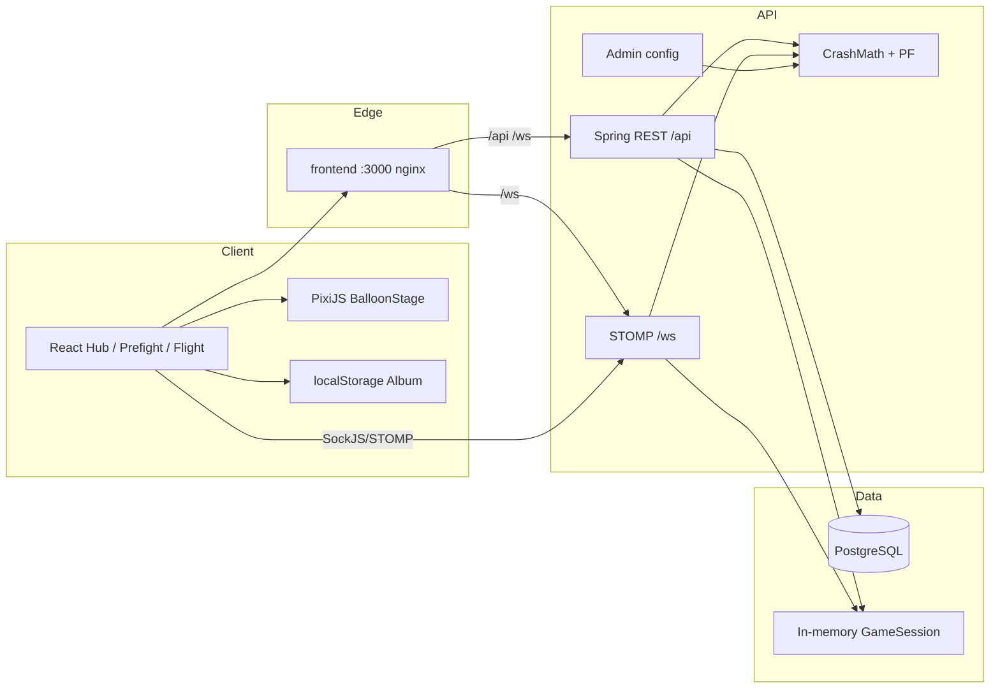
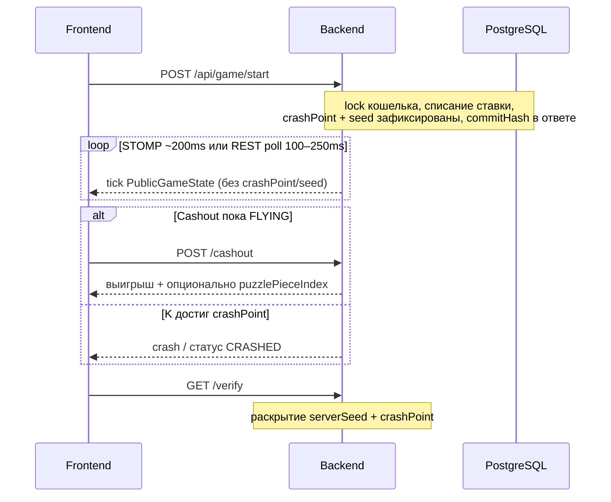

# Воздушный Шар — Victorian Steampunk Crash

**AeroQuest** · Crash на аэростате · Provably Fair · Real-time · Steampunk UI

[](https://openjdk.org/)
[](https://spring.io/projects/spring-boot)
[](https://react.dev/)
[](https://pixijs.com/)
[](https://www.docker.com/)
[](pom.xml)
[](#5-быстрый-старт)

> Высокопроизводительная **crash**-игра в эстетике Victorian Steampunk: серверная математика, STOMP WebSocket в реальном времени, provably fair и клиентский альбом пазла.

**Для жюри / тюнинга:** [docs/expert-guide.md](docs/expert-guide.md) · Фронт: [frontend/README.md](frontend/README.md)

---

## Оглавление

1. [Демо и визуал](#1-демо-и-визуал)
2. [О проекте](#2-о-проекте)
3. [Ключевые особенности](#3-ключевые-особенности)
4. [Архитектура](#4-архитектура)
5. [Быстрый старт](#5-быстрый-старт)
6. [Конфиг и админка](#6-конфиг-и-админка)
7. [API](#7-api)
8. [Roadmap](#8-roadmap)

---

## 1. Демо и визуал

### Запуск за одну минуту

```bash
docker compose up --build
```

Откройте **[http://localhost:3000](http://localhost:3000)** — Hub → выбор темы (корзины) → Prefight → полёт → результат → альбом.

| Поверхность | URL |
|-------------|-----|
| **Игра (UI)** | [http://localhost:3000](http://localhost:3000) |
| **Health API** | [http://localhost:8080/actuator/health](http://localhost:8080/actuator/health) |
| **Админка / OpenAPI** | [http://localhost:8080/swagger-ui.html](http://localhost:8080/swagger-ui.html) |

> **Отдельной страницы `/admin` нет.** Баланс параметров крутится через Swagger → Authorize → `AdminKey` = `change-me-in-prod` → `GET`/`PUT /api/admin/config`. Подробнее в [§6](#6-конфиг-и-админка).

### Видео для жюри

Перед питчем положите короткий скринкаст / GIF (~20–40 с):

1. Hub — покачивающиеся корзины LUCKY / STANDARD  
2. Полёт — карта-небо, альтиметр K, вспышка пара на бустере  
3. Краш или «Забрать» → пергаментный Result + фрагмент пазла  
4. Альбом — сетка 24 слота  

```text
docs/demo.gif           ← запись экрана
docs/presentation.pdf   ← опционально слайды для жюри
```

<!-- Когда файл появится:

-->

**Live demo:** Docker-стек выше (или вставьте сюда URL туннеля / Cloudflare, когда задеплоите).

---

## 2. О проекте

### Проблема

Обычные бонусные / crash-игры часто выглядят как **безликое казино**: плоские множители, нет характера, нет причины вернуться после первого cashout. Визуал и коллекция — вторичны.

### Решение

**Воздушный Шар** оборачивает классическую crash-математику в **викторианское steampunk-приключение**:

- Чёткие **красный (LUCKY)** и **зелёный (STANDARD)** аэростаты — разный силуэт и экономика  
- **Иммерсивный полёт** (PixiJS): атмосфера карты, альтиметр, VFX горелки/пара  
- **Альбом пазла** — фрагменты после терминальных раундов, `localStorage`  
- **Горячий админ-конфиг** — α, house edge, темы, бустеры **без редеплоя**  
- **Provably Fair** — краш и seed фиксируются на старте; раскрытие только после конца раунда  

### Стек

| Слой | Технологии |
|------|------------|
| **Backend** | Java **21**, Spring Boot **3.4**, Spring WebSocket (STOMP), JPA, Flyway, PostgreSQL **16** |
| **Frontend** | React **19**, TypeScript, Vite, **PixiJS 8**, Framer Motion, Zustand, `@stomp/stompjs` |
| **DevOps** | Docker + Docker Compose (postgres · backend · frontend/nginx) |
| **Контракт** | springdoc OpenAPI / Swagger UI |

Игрок: заголовок `X-Player-Id`. Админ: `X-Admin-Key`. Формы логина Spring Security нет (удобно для хакатона).

---

## 3. Ключевые особенности

| | Фича | Зачем это важно |
|---|------|-----------------|
| Геймплей | Серверный \(K(t)=e^{αt}\), Pixi-полёт, STOMP + REST poll fallback | Плавно в real-time, краш не доверяем клиенту |
| Steampunk UI | Пергамент / латунь, корзины тем, meter-шрифт для K, тематические SFX | Сразу читается идентичность для жюри |
| Коллекция | Альбом 24 слота (`balloon.puzzleAlbum.{playerId}`) | Retention **без** новых backend API |
| Две темы | STANDARD — спокойнее α / ниже ставка · LUCKY — быстрее α / выше потолок | Разная экономика, не только цвет |
| Бустеры | Конечные заряды; AUTO −1; множит K и очки на линии | Дополнительное напряжение в полёте |
| Админка | `PUT /api/admin/config`, частичный JSON merge | Жюри крутит баланс «на горячую» |
| Provably Fair | `crash-v1` commit на старте; `GET /verify` после терминала | Прозрачная честность |
| Устойчивость | FLYING → VOID + refund при рестарте; rate limit на start/cashout | Продакшен-краевые случаи |

---

## 4. Архитектура



### Жизненный цикл раунда



### Ключевые решения

| Выбор | Почему |
|-------|--------|
| **PixiJS** для полёта | Производительность canvas, pause ticker на скрытой вкладке, `lowDetail` на узких экранах |
| **STOMP WebSocket** | Низкая задержка тиков; REST `/state` остаётся fallback |
| **K считает сервер** | Одна формула по часам для всех клиентов; краш загадан на старте |
| **Снимок конфига на раунд** | `PUT` админки mid-flight **не** двигает уже летящий раунд |
| **Альбом на клиенте** | Коллекция без доработки серверного ledger |

---

## 5. Быстрый старт

### Требования

- **Docker Desktop** (свободны порты **3000**, **8080**, **5433**)
- Опционально для HMR фронта: **Node 20+**
- Опционально для локального бэка: **Java 21** + Maven wrapper (`./mvnw`)

### Установка (рекомендуется)

```bash
git clone <this-repo>
cd balloon-game
docker compose up --build
```

| Сервис | URL |
|--------|-----|
| Игра | http://localhost:3000 |
| API | http://localhost:8080 |
| Swagger (админ + player API) | http://localhost:8080/swagger-ui.html |

Стоп: `Ctrl+C`, при необходимости `docker compose down`. Данные Postgres: volume `postgres-data`.

### Быстрый путь в Swagger

1. Swagger → **Authorize**  
2. **PlayerId** = `demo` (любая строка)  
3. **AdminKey** = `change-me-in-prod`  
4. `POST /api/players/demo/deposit` → `{"amount": 1000}`  
5. `POST /api/game/start` → скопировать реальный `gameId` (UUID из примеров OpenAPI — заглушка)  
6. Poll state / cashout / verify  

### Только фронт (HMR)

```bash
docker compose up postgres backend
cd frontend && npm install && npm run dev
```

UI: http://localhost:5173 (Vite проксирует `/api`, `/ws`).

### Backend локально

```bash
docker compose up postgres
SPRING_DATASOURCE_URL=jdbc:postgresql://localhost:5433/balloon_game \
SPRING_DATASOURCE_USERNAME=balloon \
SPRING_DATASOURCE_PASSWORD=balloon \
./mvnw spring-boot:run
```

Тесты: `./mvnw test` (Testcontainers нужен Docker).

---

## 6. Конфиг и админка

**Эндпоинты:** `GET` / `PUT /api/admin/config`  
**Авторизация:** заголовок `X-Admin-Key: change-me-in-prod` (Swagger → Authorize → AdminKey)  
**Merge:** частичный JSON; ключ админки в JSON **не** отдаётся и через PUT **не** меняется  
**Летящие раунды:** живут на снимке конфига со **start** — новый α только для **новых** раундов  

### Параметры с сильным эффектом

| Параметр | Default | Эффект |
|----------|---------|--------|
| `math.growthRate` (α) | `0.0433` | Скорость \(K(t)=e^{αt}\); темы перекрывают |
| `themes.standard.growthRate` | `0.0367` | Спокойный рост зелёного |
| `themes.lucky.growthRate` | `0.0567` | Более быстрый рост красного |
| `math.houseEdge` | `0.08` | House edge PF / раздача краша |
| `math.instantCrashRate` | `0.08` | Шанс мгновенного краша на минимуме (1.00×) |
| `math.minCrashPoint` | `1.00` | Пол краша |
| `math.minCashoutMultiplier` | `1.01` | Раньше → `CASHOUT_TOO_EARLY` |
| `pointsPerLine` | `10` | Очки за линию высоты |
| `ascentSpeedLinesPerSec` | `1.5` | Темп набора линий |
| `boosters.spawnProbability` | `0.45` | Шанс спавна бустера |
| `admin.allowDeposit` | `true` | Демо-пополнение (+ заряд бустера) |
| `admin.maxWinMultiplier` | `100` | Потолок (тема может снизить) |

Пример горячего тюнинга (медленнее рост):

```http
PUT /api/admin/config
X-Admin-Key: change-me-in-prod
Content-Type: application/json

{
  "math": { "growthRate": 0.04 },
  "themes": {
    "standard": { "growthRate": 0.033 },
    "lucky": { "growthRate": 0.05 }
  }
}
```

Полная таблица и чеклист жюри: **[docs/expert-guide.md](docs/expert-guide.md)**. Дефолты: `src/main/resources/application.yml`.

---

## 7. API

**Живой контракт:** [Swagger UI](http://localhost:8080/swagger-ui.html) · [OpenAPI JSON](http://localhost:8080/v3/api-docs)

| Метод | Путь | Назначение |
|-------|------|------------|
| `POST` | `/api/players/{id}/deposit` | Демо-кредит (+ заряд бустера) |
| `GET` | `/api/players/{id}/balance` | Кошелёк (welcome-баланс при первом get) |
| `GET` | `/api/players/leaderboard` | Рейтинг по очкам |
| `POST` | `/api/game/start` | Ставка, новый раунд → `gameId`, `commitHash` |
| `GET` | `/api/game/state/{gameId}` | Poll полёта (`PublicGameState`) |
| `POST` | `/api/game/cashout/{gameId}` | Забрать выигрыш пока `FLYING` |
| `GET` | `/api/game/verify/{gameId}` | Раскрыть PF после терминала |
| `GET` | `/api/game/history` | Публичная лента (без секретов) |
| `GET`/`PUT` | `/api/admin/config` | Математика / темы / бустеры в runtime |

**Заголовки:** `X-Player-Id` на игровых маршрутах (должен совпадать с владельцем ставки). History публичный.

**WebSocket:** `ws://localhost:8080/ws` (SockJS: `/ws-sockjs`)  
CONNECT с native-header `X-Player-Id` → подписка `/topic/game/{gameId}`  

```json
{
  "type": "tick",
  "state": {
    "gameId": "...",
    "status": "FLYING",
    "multiplier": 1.42,
    "lineIndex": 3,
    "pointsTotal": 30,
    "booster": null
  }
}
```

`type`: `tick` | `crash` | `cashout` | `void`. Пока идёт полёт, в payload **нет** `crashPoint` / `serverSeed`.

Ошибки: `{ "code", "message", "timestamp", "details"? }` — например `INSUFFICIENT_BALANCE` (402), `FORBIDDEN` (403), `ALREADY_CRASHED` (409), `RATE_LIMITED` (429).

---

## 8. Roadmap

- [x] MVP backend — crash math, ledger, PF, admin config, STOMP  
- [x] Frontend — Hub → Prefight → Flight → Result  
- [x] Steampunk UI — chrome, корзины, Pixi-полёт, альбом, SFX  
- [ ] Опционально: demo GIF + слайды жюри в `docs/`  
- [ ] Опционально: серверный альбом пазла (синхронизация между устройствами)  
- [ ] Stretch: PWA / installable mobile  
- [ ] Stretch: CC0 sample-pack вместо чистого синтеза звука  
